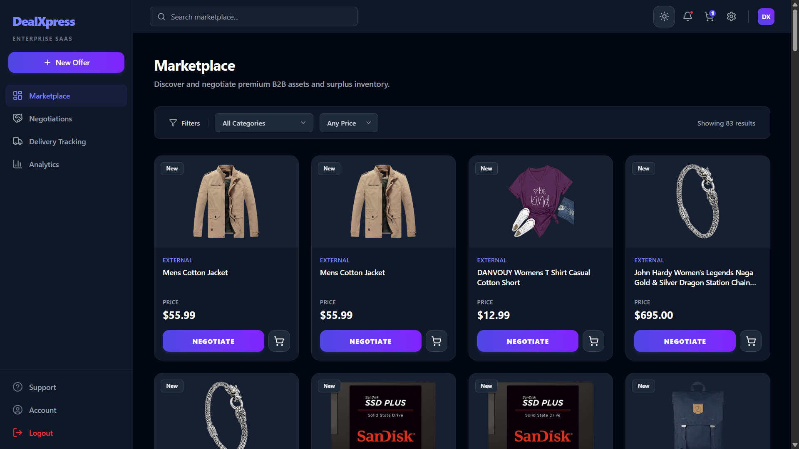
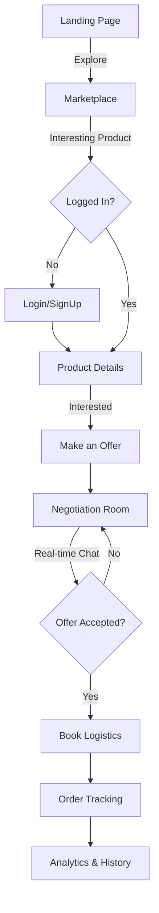

# 🚀 DealXpress - The Ultimate Marketplace & Logistics Ecosystem


<p align="center">
  <a href="https://deal-xpress.vercel.app">
    
  </a>
  <a href="https://dealxpress.onrender.com">
    
  </a>
  <a href="https://www.figma.com/design/pcZTA0YGwea3f4Zh6a7W9A/DealXpress?node-id=0-1&t=fa1ld6Br2HxuwlV2-0">
    
  </a>
  <a href="https://documenter.getpostman.com/view/50840642/2sBXqKnf6N">
    
  </a>
</p>

<p align="center">
  🔗 <b>Figma Design:</b> <a href="https://www.figma.com/design/pcZTA0YGwea3f4Zh6a7W9A/DealXpress?node-id=0-1&t=fa1ld6Br2HxuwlV2-0">View Interactive Prototype</a>
</p>

---

**DealXpress** is a premium, full-stack e-commerce ecosystem designed to revolutionize how buyers and sellers interact. By integrating **Real-Time Price Negotiation** and **Instant Logistics Booking** into a single, seamless platform, DealXpress eliminates the friction between deal-making and delivery.

## 🔗 Live Demo & Documentation
- **Frontend (Live Site):** [https://deal-xpress.vercel.app](https://deal-xpress.vercel.app)
- **Backend (API Base):** [https://dealxpress.onrender.com](https://dealxpress.onrender.com)
- **API Documentation (Postman):** [https://documenter.getpostman.com/view/50840642/2sBXqKnf6N](https://documenter.getpostman.com/view/50840642/2sBXqKnf6N)

---

<p align="center">
  
</p>

## ✨ Full Feature List

### 🔑 Authentication & Security
*   **Google OAuth 2.0:** Secure one-click social login.
*   **JWT Authentication:** Robust token-based auth for secure API access.
*   **RBAC (Role Based Access Control):** Distinct workflows for Buyers and Sellers.
*   **Password Recovery:** Secure forgot password flow with email verification.

### 🛒 Premium Marketplace
*   **Advanced Discovery:** Dynamic search, multi-category filtering, and smart sorting.
*   **Interactive UI:** Sleek product cards with hover effects and glassmorphic design.
*   **Rich Details:** Comprehensive product descriptions, specifications, and seller info.

### 🤝 Smart Negotiation System (The "Deal" in DealXpress)
*   **Make Offer:** Buyers can propose custom prices directly from product pages.
*   **Negotiation Room:** A dedicated real-time chat interface for buyers and sellers to discuss deals.
*   **Offer Lifecycle:** Interactive status tracking (Pending → Accepted → Rejected → Counter-Offer).
*   **Live Notifications:** Instant updates via Socket.io when an offer is received or updated.

### 🚚 Integrated Logistics & Tracking
*   **Instant Quotes:** Real-time delivery cost estimation based on pickup and drop-off points.
*   **One-Click Booking:** Seamlessly book delivery as soon as a deal is finalized.
*   **Step-by-Step Tracking:** Visual progress bar for order fulfillment and delivery status.

### 📊 Professional Analytics Dashboard
*   **Visual Insights:** Data visualization using Recharts for sales, offers, and spending trends.
*   **Activity Logs:** Detailed history of all negotiations, orders, and notifications.
*   **Account Management:** Profile customization, address management, and security settings.

---

## 🧱 Tech Stack

| Layer | Technologies |
| :--- | :--- |
| **Frontend** | React 19, Vite, Tailwind CSS 4, Redux Toolkit, Framer Motion, Spline (3D), Recharts, Lucide Icons |
| **Backend** | Node.js, Express 5, Socket.io, JWT, Google OAuth, Express-Async-Handler, Morgan |
| **Database** | MongoDB Atlas, Mongoose |
| **Logistics** | Custom Pricing Algorithm & Tracking System |

---

## 📁 Project Structure

### 🖥️ Frontend (React + Vite)
```text
Frontend/
├── public/            # Static assets (Hero image, logos)
├── src/
│   ├── app/           # Redux store configuration
│   ├── features/      # Logic modules (Auth, Negotiation, Orders)
│   ├── components/    # Reusable UI (Modals, Cards, Nav, Layouts)
│   ├── pages/         # Screen components (Marketplace, Room, Analytics)
│   ├── services/      # API communication layers
│   ├── hooks/         # Custom React hooks (useAuth, useSocket)
│   ├── utils/         # Helper functions & constants
│   ├── routes/        # Protected & Public routing logic
│   └── assets/        # Lottie animations & Styles
```

### ⚙️ Backend (Node + Express)
```text
Backend/
├── src/
│   ├── controllers/   # Business logic (Deal flow, Analytics, Users)
│   ├── models/        # Mongoose Data Schemas (Negotiation, Order, Notification)
│   ├── routes/        # API endpoint definitions
│   ├── middleware/    # Auth, Error handling, & Rate limiting
│   ├── services/      # Third-party integrations (Google Auth, Email)
│   ├── sockets/       # Real-time event logic
│   ├── config/        # Database & Environment variables
│   └── app.js         # Express app initialization
├── index.js           # Server entry point
```

---

## 🔄 User Journey & Workflow

DealXpress is built around a logical flow that takes a user from product discovery to successful delivery.



### 1. Discovery & Authentication
Users start at the **Landing Page** and move to the **Marketplace** to browse products. To perform any action (like making an offer), they must **Login** or **Sign Up**.

### 2. The Negotiation Phase
Once an offer is made, a dedicated **Negotiation Room** is created. Here, the buyer and seller communicate in real-time. Statuses like *Pending*, *Countered*, or *Accepted* update instantly across both dashboards.

### 3. Fulfillment & Logistics
As soon as a deal is struck (Offer Accepted), the **Logistics** module unlocks. Users can enter delivery details to get an instant quote and book shipping.

### 4. Tracking & Insights
Post-booking, users can monitor their order via the **Tracking System**. The **Analytics Dashboard** provides a bird's-eye view of all deals, spending patterns, and logistics history.

---

## 🛡️ Access Control & Routing

DealXpress implements a robust routing system with multi-level access control to ensure data security and a smooth user flow.

### 🌐 Public Routes (Accessible to Everyone)
*   **Landing Page (`/`):** Project introduction and core value proposition.
*   **Authentication:** `/login`, `/signup`, and `/forgot-password`.
*   **Marketplace (`/marketplace`):** Browse all available products without needing an account.
*   **Contact (`/contact`):** Get in touch with the support team.

### 🔐 Protected Routes (Login Required)
*   **Negotiations (`/negotiations`):** Manage active offers and view deal history.
*   **Negotiation Room (`/negotiation-room/:id`):** Real-time chat and deal-making interface.
*   **Logistics & Delivery (`/delivery`):** Book and track shipments.
*   **Analytics Dashboard (`/analytics`):** Visual data insights for buyers and sellers.
*   **Account Settings (`/account`):** Profile management and security configuration.

### ⚙️ How it Works
1.  **Auth Guard:** The `ProtectedRoute` component intercepts restricted routes, checking for a valid JWT token in the application state.
2.  **Redirect Logic:** Unauthenticated users attempting to access protected pages are automatically redirected to the `/login` page.
3.  **Persistence:** Login state is persisted via Redux Toolkit and validated against the backend on every session initialization.

---

## ⚙️ Installation & Setup

1.  **Clone the Repo:**
    ```bash
    git clone https://github.com/Jilanmansuri/dealXpress.git
    cd dealXpress
    ```

2.  **Frontend Installation:**
    ```bash
    cd Frontend
    npm install
    npm run dev
    ```

3.  **Backend Installation:**
    ```bash
    cd Backend
    npm install
    # Setup .env (MONGO_URI, JWT_SECRET, GOOGLE_CLIENT_ID)
    npm run dev
    ```

---

## 📬 Contact & Support

**Jilan Mansuri**
📧 [jilan2410@gmail.com](mailto:jilan2410@gmail.com)
🌐 [Live Platform](https://deal-xpress.vercel.app)

---

## ✅ Final Project Update (May 1, 2026)
The project is now officially **COMPLETE** and industry-ready. The final phase focused on:
*   **Comprehensive Audit:** Verified all features against industry-standard checklists.
*   **Auth Stabilization:** Fixed profile photo persistence and synchronized local state with backend tokens.
*   **UI/UX Polishing:** Finalized Dark Mode consistency across all modules (`Marketplace`, `Analytics`, `Auth`).
*   **Production Readiness:** Optimized API endpoints with environment variables and resolved CORS/Socket.io routing for Vercel/Render deployments.
*   **Performance:** Refined loading states and error handling for a seamless user experience.

---

## 📜 License
This project is licensed under the MIT License.
